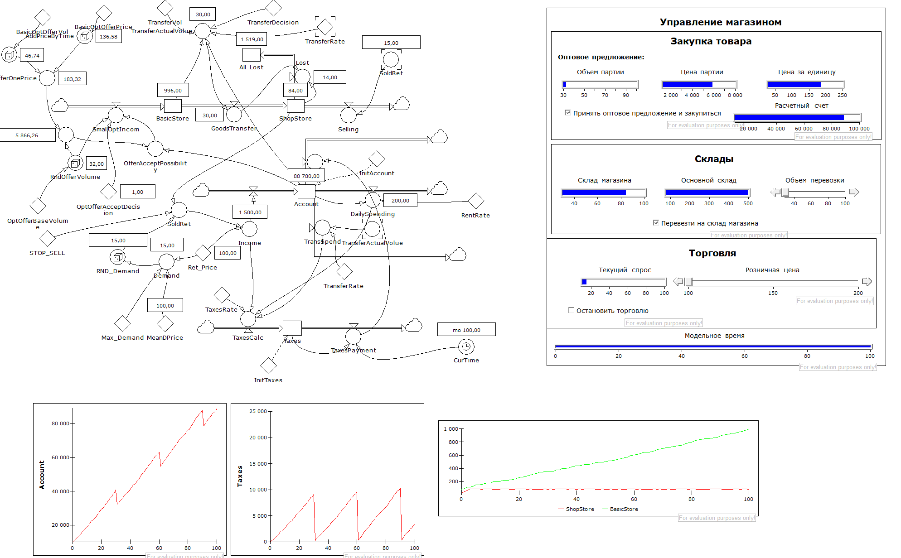
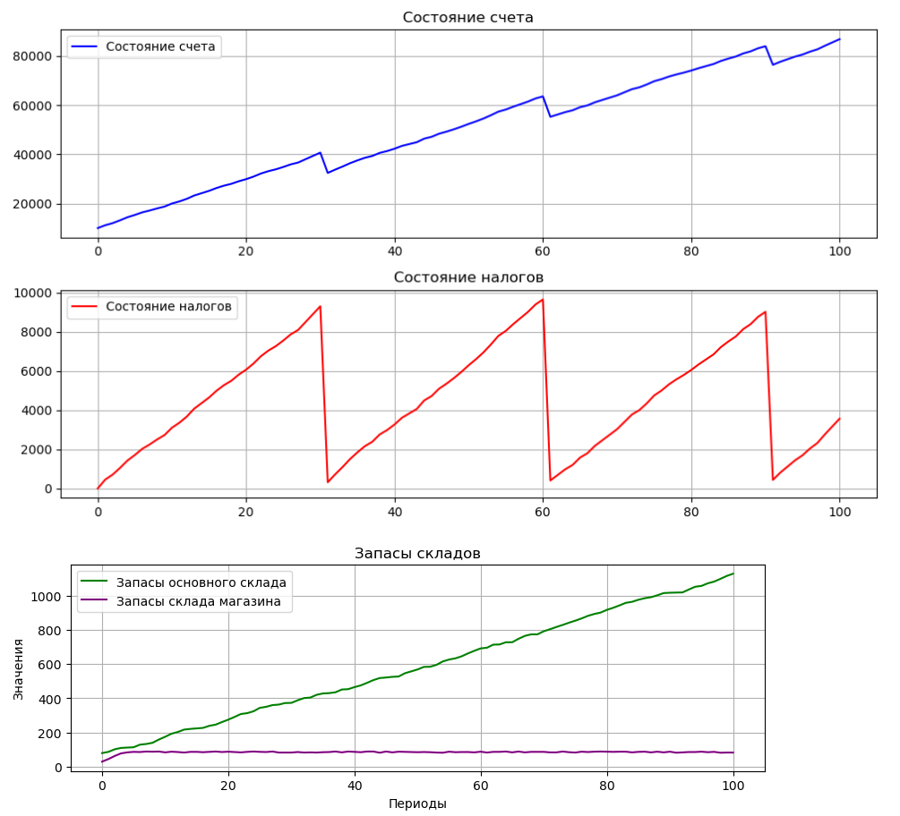

# Цель работы:
Знакомство с системно-динамическим программированием

# Задачи:
- Добавить новый уровень в модель
- Написать код с указанными в задании требованиями

# Описание:
В исходную модель было решено добавить уровень подсчета налоговой базы и суммы накопленных налоговых задолженностей 
с последующим вычетом налога со счета. 
- Реализация в PowerSim Studio:

- Результаты моделирования с теми же параметрами в коде на языке python:

Как можно видеть по графикам значений уровней реализации совпадают.

# Заключение
В исходную модель магазина был добавлен уровень, отвечающий за налогообложение.
Был написан код на языке Python, который реализует логику, представленную на графике моделирования.
